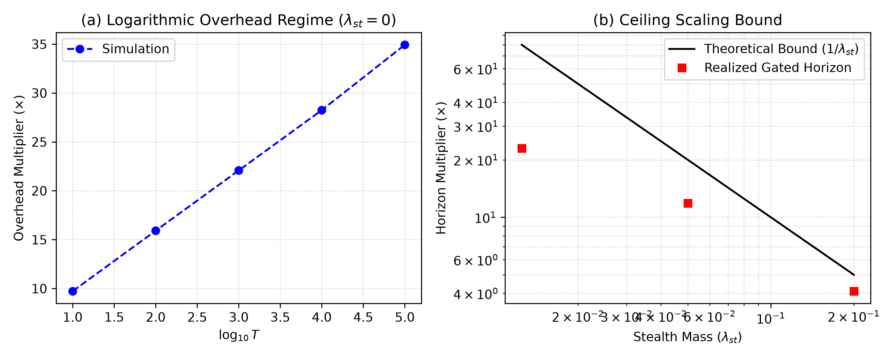

# A Fault-Tolerance Threshold for Gated Agentic Computation

**Reliable Long-Horizon Work from Unreliable Executors** — Ivo Matijašević

[](LICENSE)
[](https://doi.org/10.5281/zenodo.20820968)

📄 **Read the paper:** [**paper.pdf**](paper.pdf) (pre-compiled) · source: [`paper.tex`](paper.tex)
🧪 **Reproduce every number and figure:** [`simulate.py`](simulate.py) — runs in a few seconds.

This repository is the companion to the paper: a self-contained, validated simulation
that reproduces all of its numerical claims and both figures.

> **Part II (draft, not yet released):** [`paper_part2.tex`](paper_part2.tex) is a synthesis that applies four
> classical tools to the Part I model — series-system reliability, epistemic/diagnosability semantics, a
> reliability-amplification cost comparison, and the association (Harris/FKG/Esary–Proschan–Walkup)
> inequality — showing they converge on the verification floor. The mathematics is classical and
> attributed as such; the contribution is the synthesis and one closed-form cost comparison. Its numbers
> reproduce via [`simulate_part2.py`](simulate_part2.py). Draft PDF: [`paper_part2.pdf`](paper_part2.pdf) (locally regenerated). Working draft pending review — no DOI yet.

---

## Abstract

> Autonomous agents (whether language-model based, human, or hybrid) commit errors at an
> approximately constant rate per unit of work, so the probability that a long task completes
> without fault decays *exponentially* in its length. The task length at which an agent succeeds
> half the time — its **horizon** — has become a leading proposed metric of agentic capability,
> and empirically it has grown exponentially over recent years. We ask a different question: given
> a *fixed* agent, how far can **verification** extend its reliable horizon? We model long-horizon
> work as a sequence of checkpointed segments, each verified by a stack of imperfect gates combined
> by majority vote, and prove a fault-tolerance threshold analogous to von Neumann's
> reliable-computation-from-unreliable-components result and to the quantum threshold theorem.
> **(i)** When gates are conditionally independent and better than chance, a stack of *O*(log *T*)
> gates per checkpoint achieves any target reliability over horizon *T* at multiplicative overhead
> *O*(log *T*). **(ii)** When gates share a blind spot — a stealth mass λ&#8202;<sub>st</sub> of
> faults invisible to the *entire* gate family — the reliable horizon is capped at
> *H*<sub>gated</sub> ≈ *H*<sub>raw</sub>&#8202;/&#8202;λ&#8202;<sub>st</sub> regardless of gate
> count. **(iii)** The cost-optimal checkpoint interval is *s*\* ≈ √(*G*/λ), a direct analogue of
> the classical Young–Daly checkpoint formula. The binding constraint on autonomous horizon is
> therefore not raw model capability but the **diversity of the verification stack** — a quantity
> partly estimable from a system's own telemetry and targeted audits. We further decompose the
> stealth mass into a diversity-reducible part and a specification-bound irreducible floor.

## Key takeaways

- **Verification beats capability — up to a point.** Errors that compound can also be *intercepted*.
  If work is split into verifiable segments and each is checked before the agent proceeds, detected
  faults are repaired locally and never compound. Reliability is then governed by the quality of the
  *checking*, not directly by the agent.

- **Logarithmic overhead (the threshold, Thm. 1).** As long as each gate is better than chance
  (false-accept and false-reject rates both `< ½`) and the gates are conditionally independent, only
  **`m = O(log T)`** gates per checkpoint are needed to hit any reliability target over a horizon
  `T`. Verification cost grows *logarithmically* in horizon — reliable work of unbounded length is
  affordable. *(Simulated: the gate budget for fixed 90% end-to-end success grows linearly in
  `log T`, from `m = 33` at `T = 10` to `m = 131` at `T = 10⁵`.)*

- **The `1/λ_st` ceiling (the blind spot, Thm. 2).** If a fraction **`λ_st`** of bad segments are a
  *shared blind spot* that the whole gate family passes, then **no amount of gates** helps past
  `H_gated ≈ H_raw / λ_st`. Stacking more of the *same kind* of gate hits a wall; only
  **diversity across independent gate families multiplies the ceiling down** (`λ_st⁽¹⁾·λ_st⁽²⁾`).
  *(Simulated: with equal budget, three diverse families reach `51×` the raw horizon where one deep
  same-family stack plateaus at `5.2×` — a `~10×` separation from gate composition alone.)*

- **The floor that diversity can't fix.** The stealth mass splits as `λ_st = λ_red + λ_irr`:
  the lineage-correlated part `λ_red` that diversity removes, and a **specification/intent floor**
  `λ_irr` (faults that satisfy the checkable contract but violate intent) that traps *every* family.
  Only reality-grounding — execution against the true environment — lowers `λ_irr`.

- **Compute your checkpoint interval (Thm. 3).** The cost-optimal spacing is **`s* ≈ √(G/λ)`** — the
  Young–Daly checkpoint formula with verification cost in place of crash-recovery cost. Checkpoint
  more often when the agent is weak (high `λ`) or gates are cheap (low `G`).

**Bottom line:** the binding constraint on autonomous horizon is the *diversity* of the verification
stack, not raw model capability — and a large share of that is verification engineering available
today.

## Notation

The paper defines every symbol inline; this is a quick reference for the ones used above.

<details>
<summary>Click to expand the symbol table</summary>

| Symbol | Meaning |
|---|---|
| `T` | task length to complete, in human-equivalent time (the length verified over; the `T` in `O(log T)`) |
| `λ` | fault arrival rate (Poisson, per unit work) |
| `s` | segment length = checkpoint interval |
| `n = T/s` | number of segments |
| `p = 1 − e^(−λs)` | probability a segment is bad (≥ 1 fault) |
| `m` | gates per checkpoint (combined by majority vote) |
| `g` | per-gate evaluation time / cost |
| `G = m·g` | per-checkpoint verification time |
| `α`, `β` | per-gate false-accept / false-reject rate |
| `ᾱ_m`, `β̄_m` | effective majority-vote rates for a stack of `m` gates |
| `λ_st` | stealth mass — bad segments the whole gate family passes |
| `λ_irr`, `λ_red` | irreducible (spec/intent) floor / reducible (lineage-correlated) part |
| `ρ`, `k` | per-family reducible-stealth probability / number of independent families |
| `P_adv` | per-round advance probability of the recomputation loop |
| `ε_seg = p·ᾱ_m / P_adv` | per-segment slip probability |
| `H_raw`, `H_gated` | the **horizon** metric — task length at which success = ½; ungated (`H_raw = ln 2 / λ`) vs gated |
| `s* = √(G/λ)` | cost-optimal checkpoint interval |

</details>

## Reproduced results

Running `python simulate.py` regenerates these (all numbers are seed-independent — see *How it
works*):



*(a)* the gate budget for fixed reliability grows **linearly in `log T`** (logarithmic overhead);
*(b)* the realized horizon multiplier rises toward — and stays under — the **`1/λ_st`** ceiling.

| Result | Paper | Simulation reproduces |
|---|---|---|
| Per-segment slip (Lemma 1, `m=5`) | `ε_seg = 0.0446` | `0.0446` predicted vs `0.0428` Monte-Carlo |
| Threshold gate budget `m` (`T = 10 … 10⁵`) | `33, 57, 81, 105, 131` | exact |
| Horizon multiplier vs `λ_st` (`0.2 / 0.05 / 0.0125`) | `4.1× / 11.8× / 23×` under `5× / 20× / 80×` | exact |
| Optimal interval (Thm. 3, `m=5`) | `s* = √(G/λ)`, FOC root `0.39` | numerical argmin `0.39` |
| Three-arm diversity (equal 21-gate budget) | same-family `5.2×` vs diverse `51×` | exact |

The per-gate-cost sweep (overhead vs horizon for several `g`) is written to
[`gate_cost_overhead.png`](gate_cost_overhead.png) and matches Table 1 of the paper.

## Quick start

```bash
pip install -r requirements.txt   # numpy, matplotlib
python simulate.py
```

This prints the validation table, the Fig. 1a/1b numbers, the optimal-interval and three-arm
checks, and the gate-cost sweep, and writes two figures:

- `gated_computation_validation_FULL.png` — Fig. 1: (a) threshold / log overhead, (b) `1/λ_st` ceiling
- `gate_cost_overhead.png` — overhead vs horizon for several per-gate costs `g`

Runs in a few seconds; requires Python 3.9+.

## How it works

Each segment's geometric recomputation loop collapses to its exact marginal slip probability
`ε_seg = p·ᾱ_m / P_adv` (Lemma 1), and with independent segments end-to-end success is exactly
`(1 − ε_seg)ⁿ`, where `ᾱ_m, β̄_m` are exact binomial majority-tails. The experiments evaluate these
closed forms directly, so the reported numbers are **seed-independent**. `validate_against_original()`
runs the literal slow discrete-event Monte-Carlo (success over `Binomial(n, ε_seg)` trials) and
checks it matches the closed form within sampling noise before any figure is produced.

The per-gate cost `g` (`G_PER_GATE`) is an **arbitrary illustrative constant**: it enters only
through the ratio `g/s`, which sets the vertical scale of the overhead via
`overhead = (1 + (g/s)·m) / P_adv` (the `1/P_adv` factor counts recomputation of rejected segments)
and changes neither the gate counts nor any theorem.

## Citation

If you use this work, please cite it via its Zenodo DOI:

```bibtex
@misc{matijasevic2026gated,
  author       = {Ivo Matija\v{s}evi\'c},
  title        = {A Fault-Tolerance Threshold for Gated Agentic Computation:
                  Reliable Long-Horizon Work from Unreliable Executors},
  year         = {2026},
  howpublished = {\url{https://github.com/ivmat/gated-computation-sim}},
  doi          = {10.5281/zenodo.20820968},
  url          = {https://doi.org/10.5281/zenodo.20820968},
  note         = {Preprint; archived on Zenodo.}
}
```

> `10.5281/zenodo.20820968` is the reserved DOI for this work. Each GitHub Release Zenodo archives
> gets its own version DOI; if Zenodo also assigns a *concept* DOI (one that always resolves to the
> latest version), prefer that one in the citation above for early "cite my work" use.

## License

MIT — see [LICENSE](LICENSE). © 2026 Ivo Matijašević.
